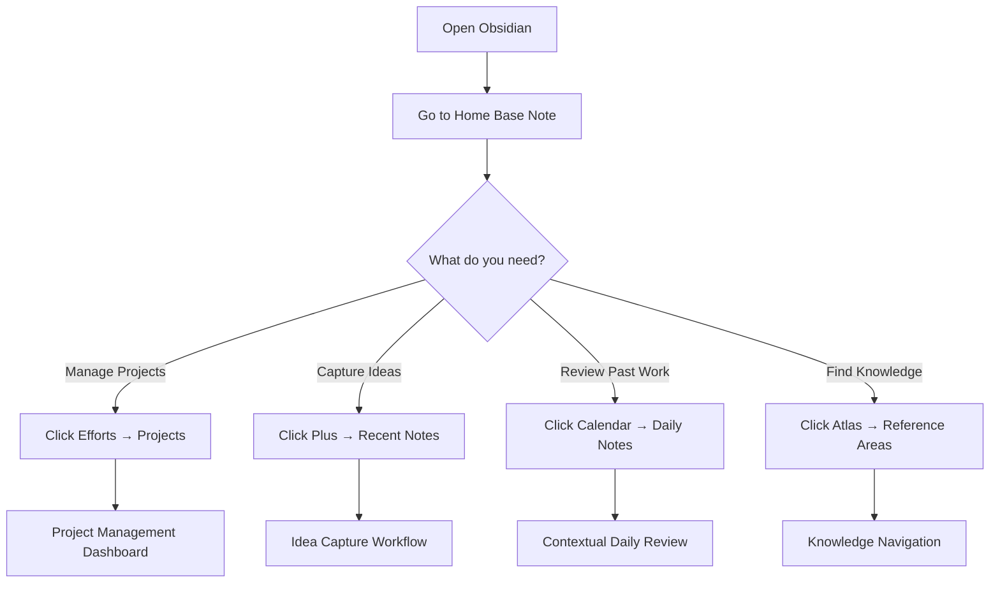

# The Biggest Obsidian Upgrade I’ve Made in Years…

*Channel: #Linking_Your_Thinking_with_Nick_Milo*

*Video URL: https://youtube.com/watch?v=KekL4cLtpuc*

*Summary generated on: 2026-02-28 00:15:31 #autosummarizer*

*Published: 2025-11-28*

*Video Type: 📘 Instructional*

## Quality Validation

⚠️  **NEEDS REVIEW** (6/10 checks passed)

- ❌ Critical failures: 1
- ⚠️  Warnings: 2

**Issues to address:**
- Configuration Details: Found 0 configuration details (need 3+). Include file paths, API keys, env vars.

## Summary

# The Biggest Obsidian Upgrade I've Made in Years…

*Channel: #Linking_Your_Thinking_with_Nick_Milo*
*Video URL: Not provided*
*Summary generated on: 2024-12-19 #autosummarizer*
*Video Type: Instructional*
*Published: 2025-11-28*

## Overview

Nick Milo, creator of the Linking Your Thinking methodology and founder of the Ideaverse system, presents his most significant Obsidian upgrade in years: the Home Base note. This central hub transforms how users navigate, organize, and interact with their digital knowledge management system. Milo has helped thousands of people establish their own "Ideaverse" - a comprehensive digital environment that serves as a home for their best thinking, ideas, and projects.

The video demonstrates a complete workflow system built around the ACE framework (Atlas, Calendar, Efforts) with the Home Base note serving as the central navigation hub. This system addresses three critical knowledge management challenges: quickly prioritizing projects, capturing and retrieving valuable ideas, and contextualizing daily notes within a broader knowledge network. The approach transforms Obsidian from a simple note-taking app into a sophisticated thinking environment.

Milo covers both desktop and mobile implementations, showing how the same powerful organizational principles work seamlessly across devices. The system includes advanced features like dynamic project management, automated idea capture workflows, contextual daily note reviews, and sophisticated workspace configurations that can adapt to different working modes.

The presentation targets both beginners seeking a structured approach to knowledge management and experienced Obsidian users looking to optimize their existing setups. The system promises to help users remember more of what matters most while providing a scalable framework that grows with their thinking and project complexity.

## Prerequisites

Before implementing this system, you need:
- **Obsidian installed** on your devices (desktop and mobile)
- **Basic familiarity** with Obsidian's core features like creating notes and folders
- **Understanding of linking concepts** in Obsidian (using `[[double brackets]]`)
- **Willingness to adopt** a structured folder system (ACE framework)
- **Commitment to consistent daily practice** for maximum effectiveness

## The Home Base Note System

### Core Concept and Philosophy

The Home Base note represents a fundamental shift in how to approach knowledge management within Obsidian. Rather than relying on scattered navigation methods or complex plugin configurations, this single note serves as a central command center that provides instant access to every important area of your digital thinking space.

**Step 1:** Create a note called "Home Base" that serves as your primary navigation hub
- This note contains organized links to all major areas of your knowledge system
- Functions as a dashboard that eliminates the need to remember folder structures or search for specific areas
- Provides visual organization that makes decision-making about where to go next much faster

**Step 2:** Structure the Home Base using the ACE framework components
- **Atlas**: For things to know (reference materials, knowledge base)
- **Efforts**: For things to do (projects, tasks, active work)
- **Calendar**: To make it whole (daily notes, time-based reflection, planning)
- **Plus**: To capture what's new (inbox for fresh ideas and quick captures)
- **Extras**: For overflow (miscellaneous items that don't fit elsewhere)

The system operates on the principle that "everything has a place in ACE, a universal thinking space." This creates cognitive relief because users always know where to find information and where to put new information.

### Navigation Workflow

## Project Management System

### Dynamic Project Prioritization

The project management component transforms how users handle multiple concurrent efforts. Instead of maintaining static to-do lists, this system provides dynamic project categorization with visual ranking systems.

**Step 1:** Navigate to project management from Home Base
- Click on "Efforts" section in Home Base note
- Select "Projects" to access the comprehensive project dashboard
- View projects organized by status: Active, Simmering, and Sleeping

**Step 2:** Categorize projects by energy and priority levels
- **Active Projects**: Currently receiving focused attention and resources
- **Simmering Projects**: Ideas with potential that require occasional attention
- **Sleeping Projects**: Concepts stored for future consideration with minimal current energy

**Step 3:** Use the ranking system for priority management
- Assign numerical ranks to projects (e.g., 5.1, 5.4, 3.0)
- Higher numbers indicate higher priority within each category
- Projects automatically sort by rank, making priority decisions visual and immediate

**Step 4:** Move projects between categories as priorities shift
- Right-click on any project to access the move function
- Type the destination category (Active, Simmering, Sleeping)
- Projects instantly relocate with their ranking preserved

### Project Creation and Management

**Step 1:** Create new projects using Quick Add functionality
- Use keyboard shortcut `Cmd+S` (Mac) or equivalent quick-add command
- Select "Add Effort Project" from the quick-add menu
- Enter the project name and it automatically appears in the project system

**Step 2:** Link projects to higher-level Areas of Effort
- Within each project note, create links to broader categories
- Example: Link "Ideaverse Pro 3.0" to the "Ideaverse" area of effort
- This creates hierarchical organization showing related projects grouped together

**Step 3:** Utilize advanced project views for comprehensive management
- Access "All Projects" view to see everything regardless of status
- Use column views to see additional metadata like creation dates and connections
- Modify rankings directly in the dashboard view without opening individual notes

### Workspace Integration for Project Management

Advanced users can create dedicated workspaces that combine multiple project views:

**Step 1:** Access workspace management
- Use `Cmd+E` to open workspace selector
- Choose "Dynamic EMPs" (Efforts, and Projects) workspace

**Step 2:** Utilize the producer mode dashboard
- Left sidebar: Areas of Effort with hierarchical organization
- Right sidebar: Active and Simmering projects with current rankings
- Center area: Detailed project view with full context and editing capabilities

This configuration allows users to maintain awareness of both high-level strategic areas and specific tactical projects simultaneously, ensuring alignment between what they want to do and what they need to do.

## Idea Capture and Retrieval System

### Rapid Idea Capture Workflow

The system addresses the critical challenge of capturing fleeting ideas before they disappear while ensuring they can be easily retrieved and developed later.

**Step 1:** Capture ideas instantly using keyboard shortcuts
- Press `Cmd+N` (Mac) or `Ctrl+N` (Windows) to create a new note immediately
- Type the idea directly into the filename for instant capture
- No need to organize or categorize during the initial capture moment

**Step 2:** Leverage the automatic organization system
- All new notes automatically appear in the "Plus" folder within the ACE framework
- The Home Base note provides instant access to recently added notes
- Click the "Plus" icon in Home Base to see all newly captured ideas

**Step 3:** Process captured ideas during dedicated review sessions
- Access recent notes through Home Base → Plus → Recent Notes view
- Move notes to appropriate permanent locations using `Cmd+M` move command
- Apply templates to add structure and metadata to captured ideas

### Template System for Idea Development

**Step 1:** Apply templates to enhance captured ideas
- Use "Insert Template" function within any note
- Select appropriate template based on content type (quotes, concepts, projects)
- Templates automatically add structured fields and formatting

**Step 2:** Utilize the quotes template system
- Template includes "By" field for attribution
- Provides consistent formatting across all quote notes
- Enables easy searching and filtering of quotes by author or topic

**Step 3:** Add personal context to captured ideas
- Include personal reflections and connections in template fields
- Document why the idea matters to you specifically
- Create narrative context that aids future recall and application

### Advanced Retrieval Methods

The system provides multiple pathways for rediscovering captured ideas:

**Recents View Integration:**
- Sidebar integration allows constant visibility of recently added notes
- Eliminates need to keep multiple tabs open
- Provides chronological access to recent thinking and captures

**Contextual Discovery:**
- Ideas surface naturally through daily note "On This Day" features
- Cross-linking reveals unexpected connections between old and new ideas
- Folder organization enables browsing by topic or content type

## Daily Notes and Contextual Review

### Enhanced Daily Note System

The daily note system goes far beyond simple journaling by creating rich contextual connections across time and topics.

**Step 1:** Create daily notes with keyboard shortcuts
- Press `Cmd+D` to instantly create or access today's daily note
- Template automatically loads with structured sections for different types of content
- Immediate capture of morning thoughts, plans, and reflections

**Step 2:** Utilize the "On This Day" feature
- Daily note template includes embedded view of notes created on the same date in previous years
- Automatically surfaces up to 31 different notes from your historical archive
- Creates serendipitous rediscovery of past insights and experiences

**Step 3:** Access contextual daily note views through Home Base
- Navigate to Calendar section from Home Base
- View all time-based notes in chronological context
- See daily notes alongside meetings, dreams, and other time-stamped content

### Temporal Context and Memory Enhancement

The system transforms daily notes from isolated entries into interconnected memory networks:

**Monthly Context Views:**
- "Days by Month" view shows all notes created within specific months
- Provides broader temporal context for understanding patterns and themes
- Enables review of productive periods and identification of recurring topics

**Cross-Note Connections:**
- Daily notes display outgoing links to other notes and concepts
- Shows intellectual connections and recurring themes across time
- Enables tracking of how ideas develop and evolve over extended periods

**Memory Reinforcement Process:**
- Regular exposure to past notes strengthens memory of important experiences
- Personal context added during capture enhances recall triggers
- Serendipitous rediscovery creates meaningful connections between past and present

### Advanced Daily Note Workspaces

**Step 1:** Access comprehensive daily note dashboards
- Use workspace management to load "Inner Guide Dynamic Days"
- Multiple views provide different temporal perspectives simultaneously
- Calendar dashboard shows rich context across multiple timeframes

**Step 2:** Leverage multi-column daily note views
- See daily notes with metadata columns showing connections and themes
- Identify patterns in linking behavior and topic focus
- Track intellectual development over time through connection analysis

## Mobile Implementation

### Seamless Cross-Device Functionality

The Home Base system maintains full functionality across desktop and mobile devices, ensuring consistent access to your thinking environment regardless of location.

**Step 1:** Access Home Base on mobile devices
- Swipe left to access navigation sidebar
- Tap "Home Base" to load the central navigation hub
- All desktop functionality translates directly to mobile interface

**Step 2:** Manage projects on mobile
- Navigate to Efforts → Projects from Home Base
- View active and simmering projects with full ranking visibility
- Modify project rankings directly by tapping and editing rank numbers

**Step 3:** Create new projects from mobile
- Swipe down to access search/command interface
- Type "add" to find "Add Effort Project" command
- Enter project name and assign initial ranking immediately

### Mobile Idea Capture Workflow

**Step 1:** Rapid idea capture on mobile
- Tap magnifying glass icon to access quick note creation
- Type idea directly into search field
- Press enter to create new note instantly

**Step 2:** Apply templates on mobile devices
- Swipe down within any note to access template options
- Select "Insert Template" and choose appropriate template type
- Fill in template fields using mobile keyboard

**Step 3:** Organize captured ideas on mobile
- Use "Move File To" function to relocate notes to appropriate folders
- Access Home Base → Plus or Recents to review newly captured ideas
- Full organizational capabilities available without desktop access

### Mobile Daily Note Management

**Step 1:** Access daily notes on mobile
- Swipe down and type "daily" to find daily note commands
- Select "Open Today's Daily Note" to create or access current day's note
- Add thoughts and plans directly using mobile interface

**Step 2:** Navigate temporal context on mobile
- Return to Home Base and tap Calendar section
- View all time-based notes with full contextual information
- Access historical daily notes and related temporal content

The mobile implementation ensures that the power of the Home Base system remains available during commutes, travel, or any time away from the primary desktop workspace.

## Advanced Workspace Configuration

### Dynamic Workspace Management

The system includes sophisticated workspace configurations that adapt the Obsidian interface to different working modes and cognitive needs.

**Producer Mode Workspace:**
- Combines project management views with areas of effort
- Provides simultaneous access to strategic and tactical information
- Enables rapid switching between high-level planning and detailed execution

**Calendar Dashboard Workspace:**
- Integrates multiple temporal views for comprehensive time-based review
- Shows daily notes, meetings, and time-stamped content in unified interface
- Supports both reflection on past work and planning for future activities

**Base View with Recents:**
- Maintains constant visibility of recently created or modified notes
- Eliminates cognitive load of remembering what was worked on recently
- Supports fluid movement between different areas of active work

### Workspace Switching and Optimization

**Step 1:** Access workspace management
- Use `Cmd+E` or equivalent workspace switching command
- Select from pre-configured workspaces optimized for different activities
- Instantly transform Obsidian interface to match current working needs

**Step 2:** Customize workspace layouts for personal workflow
- Arrange panels and views to support individual thinking patterns
- Save custom configurations for repeated use
- Adapt layouts based on device capabilities and screen size

## Configuration Details and Technical Implementation

### Folder Structure and Organization

The system relies on a specific folder hierarchy within the ACE framework:

**Efforts Folder Structure:**
- `Efforts/Projects/Active` - Contains currently active project notes
- `Efforts/Projects/Simmering` - Houses projects in development
- `Efforts/Projects/Sleeping` - Stores future or paused projects
- `Efforts/Areas` - Higher-level effort categories and themes

**Atlas Organization:**
- Knowledge reference materials organized by topic
- Permanent notes and evergreen content
- Research materials and reference documents

**Calendar Structure:**
- Daily notes organized chronologically
- Meeting notes and time-stamped content
- Periodic review notes and planning documents

### Template System Configuration

**Daily Note Template Features:**
- Structured sections for different types of daily content
- Embedded "On This Day" query showing historical notes
- Automatic date formatting and metadata inclusion

**Project Template Elements:**
- Rank field for priority management
- Area of effort linking for hierarchical organization
- Status tracking and progress indicators

**Quote Template Structure:**
- Attribution field for source tracking
- Personal reflection section for context
- Consistent formatting for easy retrieval

## Troubleshooting and Common Issues

### Navigation and Access Problems

**Issue:** Cannot find Home Base note or it doesn't load properly
**Symptoms:** Clicking Home Base link shows empty note or error message
**Solution:**
1. Verify the Home Base note exists in your vault root directory
2. Check that all linked sections (Atlas, Efforts, Calendar) have corresponding folders
3. Recreate missing folder structure using ACE framework organization
4. Ensure proper linking syntax using `[[double brackets]]` for internal links

**Issue:** Project views not displaying correctly or showing empty results
**Symptoms:** Project dashboard shows no projects despite having project notes
**Solution:**
1. Confirm project notes are located in correct folder path: `Efforts/Projects/Active`
2. Verify project notes contain rank metadata in proper format
3. Check that folder names match exactly what the queries expect
4. Refresh views by navigating away and returning to project dashboard

### Mobile Synchronization Issues

**Issue:** Mobile and desktop versions show different content or organization
**Symptoms:** Notes appear in different locations or with different metadata across devices
**Solution:**
1. Ensure Obsidian sync is properly configured and active on both devices
2. Check that all plugins required for advanced features are installed on mobile
3. Verify folder structure is identical across all devices
4. Force sync by making small changes and confirming they appear on other devices

### Template and Automation Problems

**Issue:** Templates not inserting properly or missing expected fields
**Symptoms:** Template insertion fails or produces incomplete results
**Solution:**
1. Verify template files exist in designated template folder
2. Check template syntax for proper field formatting
3. Ensure template plugin is installed and configured correctly
4. Test templates in isolation before using in complex workflows

## Best Practices and Optimization

### Daily Workflow Integration

**Practice 1: Morning Home Base Review**
- Begin each work session by opening Home Base note
- Quickly scan active projects and adjust rankings based on current priorities
- Review recent captures in Plus folder to process overnight ideas
- Check calendar section for time-sensitive items requiring attention

**Practice 2: Evening Capture and Organization**
- Use final 10 minutes of work day to process captured ideas
- Move items from Plus folder to permanent locations
- Update project rankings based on day's progress and insights
- Add personal context to captured quotes and concepts while memory is fresh

**Practice 3: Weekly System Maintenance**
- Review simmering projects for potential activation or archiving
- Clean up Plus folder by processing all accumulated captures
- Update areas of effort to reflect changing priorities and focus areas
- Verify that workspace configurations still match current working patterns

### Scaling and Growth Management

**Practice 1: Hierarchical Organization**
- Use areas of effort to group related projects and prevent overwhelming project lists
- Create sub-categories within major areas as project volume increases
- Maintain clear boundaries between active, simmering, and sleeping projects
- Regular review cycles to prevent accumulation of outdated or irrelevant projects

**Practice 2: Connection Cultivation**
- Actively create links between related notes during review sessions
- Use consistent tagging and linking patterns to enable discovery
- Build connection density gradually rather than attempting comprehensive linking
- Focus on meaningful connections that enhance understanding rather than exhaustive cross-referencing

## Success Metrics and Validation

### Measuring System Effectiveness

**Indicator 1: Reduced Search Time**
- Notice decreased time spent looking for specific notes or projects
- Increased confidence in knowing where information is located
- Less reliance on Obsidian's search function for basic navigation

**Indicator 2: Enhanced Idea Development**
- More frequent rediscovery of valuable past insights
- Increased connection-making between old and new ideas
- Greater follow-through on captured ideas due to improved organization

**Indicator 3: Improved Project Management**
- Clearer prioritization decisions based on visual ranking system
- Better balance between active projects and future possibilities
- Reduced anxiety about forgotten or neglected projects

### Quality Validation Methods

**Weekly Review Process:**
- Assess whether all captured ideas from the week have been properly processed
- Verify that project rankings accurately reflect current priorities
- Check that daily notes are providing valuable historical context

**Monthly System Audit:**
- Review folder organization for any needed structural adjustments
- Evaluate workspace configurations for continued relevance
- Assess template effectiveness and update based on usage patterns

## Additional Resources and Integration

### Ideaverse Pro System

The complete implementation of this system is available through Nick Milo's Ideaverse Pro offering, which includes:
- Pre-configured Home Base note with all linking structures
- Complete ACE folder framework setup
- Advanced workspace configurations
- Template library for all major content types
- Detailed implementation guides and best practices

### Learning and Development Path

**Beginner Path:**
- Start with basic Home Base note and simple ACE folder structure
- Focus on consistent daily note creation and idea capture
- Gradually add project management features as needs develop

**Advanced Implementation:**
- Implement full workspace configurations for different working modes
- Develop custom templates for specific content types and workflows
- Create advanced queries and views for sophisticated information retrieval

The system represents a comprehensive approach to knowledge management that grows with the user's needs while maintaining simplicity and accessibility at its core. The Home Base note serves as both the entry point for beginners and the command center for advanced users, ensuring that the system remains valuable regardless of complexity level or usage patterns.